# Portable Development Environments using Devfiles

## Introduction
In this lab we will explore how we can create portable development environments using CodeReady Workspaces and the concept of devfiles.

The devfiles offer developers a starting point for building applications by offering containerized runtime environments, starting applications with additional functionality built in, and tools to aid in development. 

For the lab today we will be using CodeReady Workspaces which is a browser based code editor that runs on OpenShift.

## Prereqs

- An IBM Cloud Account
- A GitHub account

## Accessing to the environment

The `grant cluster` method to get access to a Kubernetes cluster will assign access permissions to a cluster or namespace in a cluster that was created prior to the request. Creating a cluster and provisioning the VMs and other resources and deploying the tools may take up to 15 minutes and longer if queued. Permissioning access to an existing cluster in contrast happens in 1 or 2 minutes depending on the number of concurrent requests.

You need an IBM Cloud account to access your cluster,

1. If you do not have an IBM Cloud account yet, register at [https://cloud.ibm.com/registration](https://cloud.ibm.com/registration),
2. Or find instructions to create a new IBM Cloud account [here](NEWACCOUNT.md),

To grant a cluster,

1. You need to be given a URL to submit your grant cluster request,
1. Open the URL to grant a cluster, e.g. `https://<workshop>.mybluemix.net`,
1. The grant cluster URL should open the following page,

    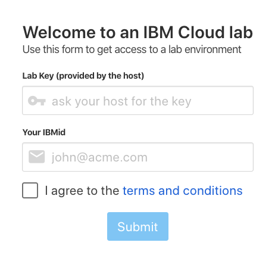

1. Log in to this IBM Cloud account using the `lab key` given to you by the instructor and your IBM Id to access your IBM Cloud account,
1. Instructions will ask to `Log in to this IBM Cloud account`

    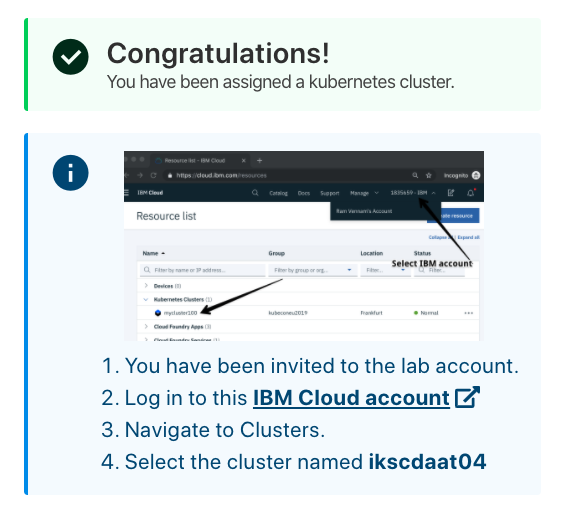

1. When you click the link to log in to the IBM Cloud account, the IBM Cloud overview page will load with an overview of all resources on the account. In the top right, you will see an active account listed. The active account should be the account on which the cluster is created, which is not your personal account. Click the account dropdown if you need to change the active account.
1. Navigate to Clusters,
1. And select the cluster assigned to you...

    

1. Details for your cluster will load.
1. Click on the blue `OpenShift web console` button.

## Using devfiles in CodeRedy Workspaces

### Accessing CodeReady Workspaces

1. To launch CodeReady Workspaces, click on **Networking** on the left navigation bar and select **Routes**.

1. In the **Project** dropdown, select **openshift-workspaces**

1. Look for the route named **codeready** and click on the link under the *location* column.

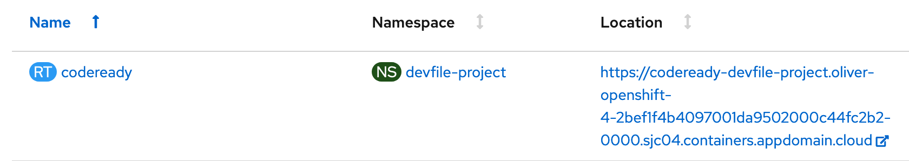

1. After navigating to the link, you should get a page asking about granting permission to CodeReady Workspaces. Select **Grant All**.

1. Then, you will be taken to the registration form that will need to be completed. It's important that for the username field you remove the `IAM#` and `@abc.com` parts of your identity. If you get an error message about the name needing to conform to DNS naming standards, remove any periods or special characters from your username and try again.

  After submitting the form you will be taken to your own personal workspaces in CodeReady Workspaces.

### Creating a DevFile in CodeReady Workspaces

  The first page you will be taken to is a page full of different sample workspaces. These workspaces contain tools and a development environment needed to start developing in those specific languages. These environment definitions are contained in what's called a **Devfile**. For this lab, we will create our own devfile and workspace.

1. Click on the **Custom Workspace** tab at the top of the page.

1. For *Workspace Name* enter **Node-Example**.

1. For the *URL of devfile* box in the *Devfile* section enter **https://raw.githubusercontent.com/odrodrig/nodejs-ex/master/devfile.yaml** and then click on **Load devfile**.

    If you are unable to load the devfile from GitHub, here are the contents that you can copy and paste in:

    ```yaml
    apiVersion: 1.0.0
    metadata:
    generateName: Node-Example
    components:
    - mountSources: true
        endpoints:
        - name: nodejs
            port: 3000
        memoryLimit: 1024Mi
        type: dockerimage
        alias: runtime
        image: 'quay.io/eclipse/che-nodejs10-ubi:nightly'
    ```

1. Click on **Create and Open** at the bottom of the page. The button might be hidden so you might need to scroll down to see it.

    The workspace will take a few minutes to fully be created.

    When done, you should see be inside the code editor.

1. Once the editor is up, click on the choice for **Git Clone** under the **New** section on the welcome page

    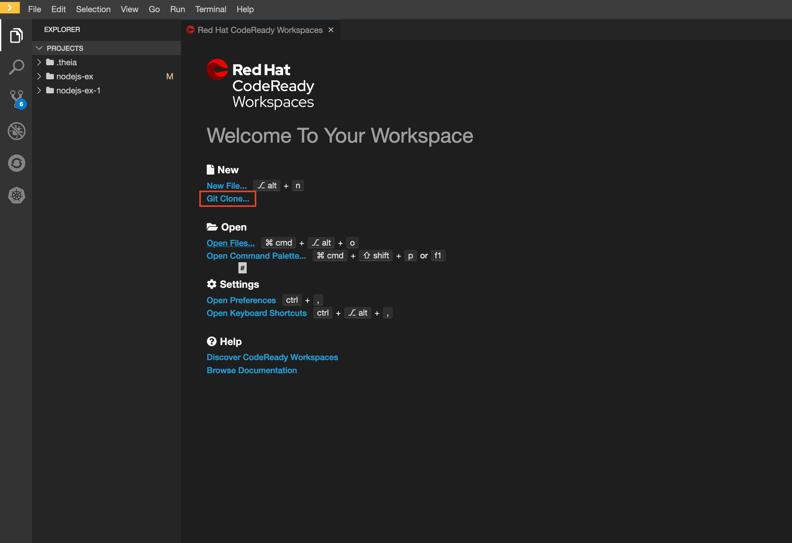

1. When asked for a *Repository URL* enter **https://github.com/odrodrig/nodejs-ex** then press enter.

1. A new window should appear asking where to save the files, accept the default and click on the ** ** button at the bottom.

1. When it is done cloning you should see a pop up in the bottom right of the page asking if it should open the clone repository. Click on **Open**.

1. Expand the project explorer by clicking on the icon that looks like 2 pieces of paper on the left toolbar. You should see the project that you cloned from GitHub.

    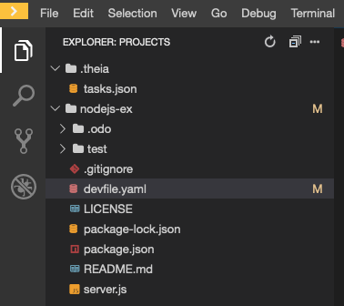

1. Click on the folder of the project that you cloned and select the **devfile.yaml** file. This is the file we used to create this workspace.

    Let's break down this file to understand what it defined for us in the workshop.

    - apiVersion - The version of the devfile API we are using. Version 2.0.0 was recently released but CodeReady Workspaces does not support it yet.
    - metadata - Contains metadata for the workspace. *Name* is a required property.
    - components - These are the additions to your workspace such as plugins and tools to assist with development or application components such as kubernetes objects or docker containers.
        - In our imported devfile, we have one component which is the containerized runtime environment for our node application.

    Another type of component that can be added is a *che plugin*, These plugins give us additional functionality in the CodeReady Workspaces IDE.
        - In our workspace let's add a typescript plugin that will give us some code completion, error checking, and more.

1. Click on **View** in the top toolbar and select **Plugins**. This will open up a new pane on the left side with a list of all plugins available to be installed.

1. In the search bar, enter **typescript** and click on the **Install** button for the result that appears.

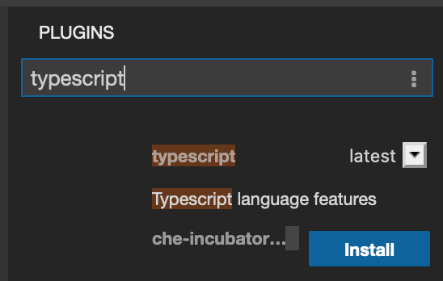

1. Then, click on the green message that appears that says *Click here to apply changes*, then click on **Restart** in the new dialog box that comes up.

    You might be asked if you are sure you want to leave the page, click on **Leave Page**.

    The workspace will be rebuilt with the new plugin installed.

1. Let's test out our new plugin. Open up the **server.js** file, type in jiberish, and see the plugin highlight the mistake. As you can see in the screenshot below, the typescript plugin (*ts*) caught the syntax error. Be sure to delete any jiberish you do type out.

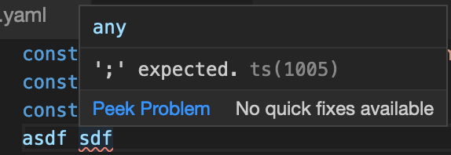

1. CodeReady Workspaces will maintain a devfile of the workspace's current configuration, including the plugin we just installed. To access this devfile, click on the yellow button at the top left of the page to expand the left menu. Then click on **Workspaces**.

1. Click on your workspace and then click on the **Devfile** tab.

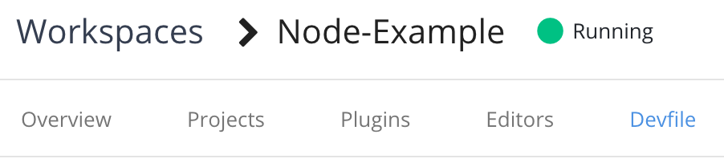

1. Copy the entire devfile contents.

1. Return to the workspace by clicking on the **Node-Example** workspace on the left menu.

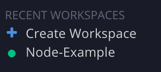

1. Then replace the contents of **devfile.yaml** with the contents you copied earlier by highlighting all the code and pasting in the devfile. You should see a new entry under **components**; the typescript che plugin.

    Another property that you can add to devfiles is the **projects** array. This will bring in those project files into the environment. For our lab we will specify a git repo in this section so that it will be cloned in automatically when the environment is created.

1. In **devfile.yaml** add the following code block to the bottom:

```yaml
projects:
  - name: nodejs-ex
    source:
      location: 'https://github.com/odrodrig/nodejs-ex.git'
      type: git
      branch: master
```

Your new devfile should look like this:

```yaml
metadata:
  name: Node-Example
components:
  - mountSources: true
    endpoints:
      - name: nodejs
        port: 3000
    memoryLimit: 1024Mi
    type: dockerimage
    alias: runtime
    image: 'quay.io/eclipse/che-nodejs10-ubi:nightly'
  - id: che-incubator/typescript/latest
    type: chePlugin
apiVersion: 1.0.0
projects:
  - name: nodejs-ex
    source:
      location: 'https://github.com/odrodrig/nodejs-ex.git'
      type: git
      branch: master
```

1. Next, let's add the **commands** array which will allow us to run commands to build and run the application within the runtime container. Add the following to the and of the devfile.

```yaml
commands:
  - name: devBuild
    actions:
      - workdir: '${CHE_PROJECTS_ROOT}/nodejs-ex/'
        type: exec
        command: npm install
        component: runtime
  - name: devRun
    actions:
      - workdir: '${CHE_PROJECTS_ROOT}/nodejs-ex/'
        type: exec
        command: nodemon app.js
        component: runtime
```

Your devfile should now look like this:

```yaml
metadata:
  name: Node-Example
projects:
  - name: nodejs-ex
    source:
      location: 'https://github.com/odrodrig/nodejs-ex.git'
      type: git
      branch: master
components:
  - mountSources: true
    endpoints:
      - name: nodejs
        port: 3000
    memoryLimit: 1024Mi
    type: dockerimage
    alias: runtime
    image: 'quay.io/eclipse/che-nodejs10-ubi:nightly'
  - id: che-incubator/typescript/latest
    type: chePlugin
apiVersion: 1.0.0
commands:
  - name: devBuild
    actions:
      - workdir: '${CHE_PROJECTS_ROOT}/nodejs-ex/'
        type: exec
        command: npm install
        component: runtime
  - name: devRun
    actions:
      - workdir: '${CHE_PROJECTS_ROOT}/nodejs-ex/'
        type: exec
        command: nodemon app.js
        component: runtime
```

1. Now we need to rebuild the workspace to include the commands we just added. Copy the contents of your new devfile.yaml then click on the yellow menu button at the top left and click on the **Workspaces** button again.

1. Next, click on your workspace and then click on the **devfile** tab. 

1. Replace the existing devfile by highlighting the code and pasting in the code that you copied from your new devfile.

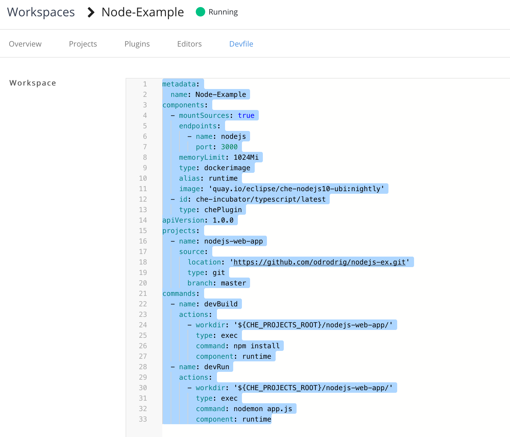

1. Then, click on the green **Apply** button at the bottom right. This will rebuild your workspace and take a few minutes.

1. Return to the workspace by clicking on the **Node-Example** workspace on the left menu.


1. Now we can run our application using the commands that we just added. Click on the **Terminal** button in the toolbar and select **Run task...**. This is where you can run commands specified in the devfile.

1. In the new dialog that appears select **devBuild**. This will run *npm install* in the runtime container to download the necessary dependencies for our application.

    You should notice a new tab appear at the bottom of the page with the build output.

1. Next, click on **Terminal** again, select **Run task...**, and this time select **devRun**. This will run the application in the runtime container and allow us to test out it's functionality.

1. After running the application, you will get a pop up saying that *A process is now listening on port 3000....*. Click on the blue button that says **Open in Preview** to open the link to view your running application.

    A new section should open up on the right side of the page which contains a preview of your application. By looking in the address bar you may also notice that this is actually running as a container on OpenShift. Any changes you make to the code will be automatically applied to the running application giving you an easy way to test changes out. Let's test this out.

1. In your project explorer on the left side of the page, click on the **nodejs-ex** folder to expand it and select **server.js**.

1. Then, go to line 55. You should see the following code there:

    ```javascript
      res.send('Hello from Node.js Starter Application with odo!');
    ```

    Go ahead and customize the message to say what ever you'd like or simply add something extra at the end of the string in between the single quotes. For example:

    ```javascript
      res.send('Hello from Node.js Starter Application with CodeReady Workspaces!');
    ```

    You should notice some output in the *devRun* tab at the bottom of the page. This means that your application has detected changes and is rebuilding.

1. Click on the refresh button in the application preview on the right side of the page to view your latest changes.

    

    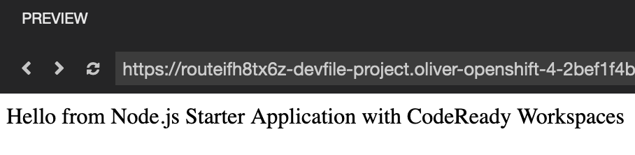

### (Optional) Pushing changes to GitHub

1. Now let's push our changes back to GitHub so that we can share this workspace with other developers. Click on the *Source Control: git* button on the left toolbar. It should look like the following:

    

1. You will be shown a list of changes we made since the project was cloned from github. Hover over the word *Changes* and you should see a **+** appear. Click on it to stage all of our changes for a commit.

1. Then click on the text box labeled *Message* and enter **Updated devfile**. Then click on the check mark right above the textbox to commit your changes.

1. Next, click on the 3-button menu in the Source Control panel and select **push**.

    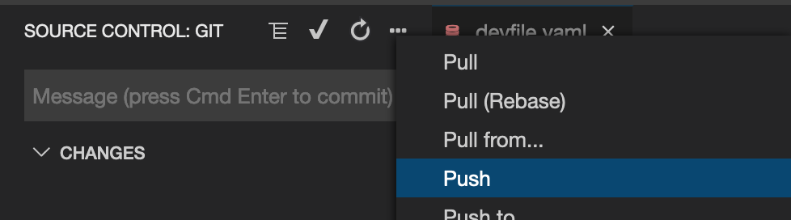

1. You will then get a prompt asking for your username. Enter your GitHub username and then press enter.

    Then, you will be asked for your password. Enter your GitHub password and press enter.

With that done your new devfile has been pushed to GitHub and can be shared with other developers using CodeReady Workspaces.

## EXTRA CREDIT: Using odo to develop containerized applications

In this section we will explore how we can take the devfile we created earlier and use it to develop our application locally.

### Getting access to an environment

1. If you have already registered your account, you can access the lab environment at [https://labs.cognitiveclass.ai](https://labs.cognitiveclass.ai) and login.

1. Navigate to [https://labs.cognitiveclass.ai/register](https://labs.cognitiveclass.ai/register),

    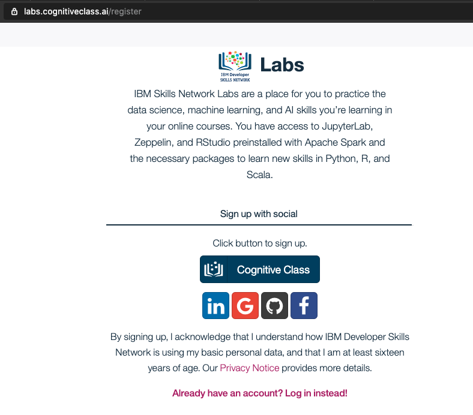

1. Create a new account with your existing `IBM Id.`

    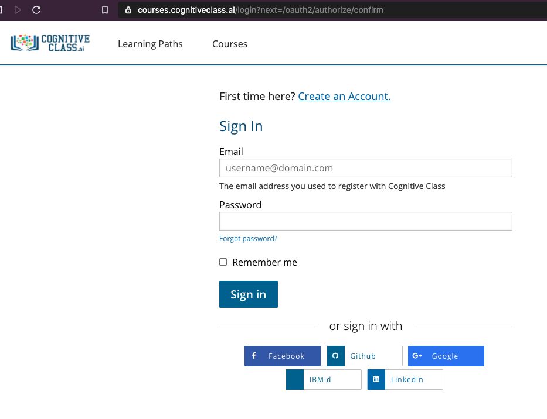

1. Alternative, you can choose to use a Social login (LinkedIn, Google, Github or Facebook), or for using your email account click the `Cognitive Class` button,

1. Click `Create an Account`,

1. Fill in your Email, Full Name, Public Username and password, click on the check boxes next to the `Privacy Notice` and `Terms of Service` to accept them. Then click on `Create Account`.

1. You will then be taken to a page with a list of sandbox environments. Click on the option for **Theia - Cloud IDE (With OpenShift)**

    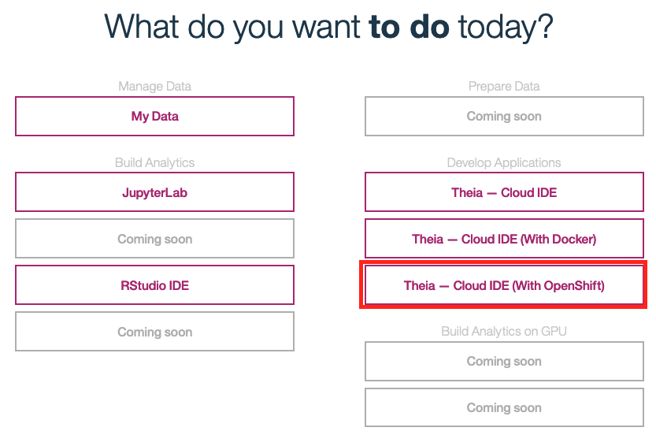

1. Wait a few minutes while your environment is created.

    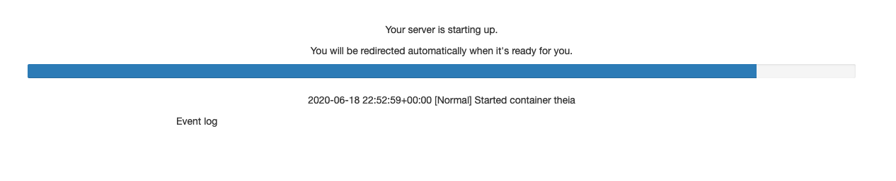

1. You will be taken to a blank editor page once your environment is ready.

1. What we really need is access to the terminal. Click on the `Terminal` tab near the top of the page and select **New Terminal**

    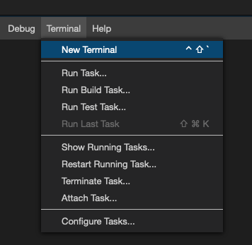

1. You can then click and drag the top of the terminal section upwards to make the terminal section bigger.

    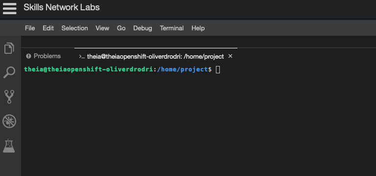

### Installing odo

1. Then, we need to clone the repository locally. Run the following command in that terminal environment:

```bash
git clone https://github.com/odrodrig/nodejs-ex.git
cd nodejs-ex
```

1. Next, we need to run the installation script for odo

```bash
bash install_odo.sh
```

### Logging into our cluster

1. Go back to your OpenShift web console and click on your username in the upper right and select `Copy Login Command` option.

    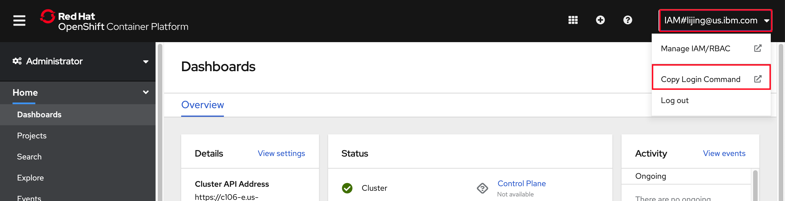

1. Click the `Display Token` link.

    

1. Copy the contents of the field `Log in with this token` to the clipboard. It provides a login command with a valid token for your username.

    

1. Go to the your web terminal on Skills Lab and paste in the log in command. Press enter.

1. Now we need to point our odo instance to our own namespace that was created for us. 

  First, list the available projects in the cluster.

  ```bash
  odo project list
  ```

  Then find your project, it should start with your username that you created when logging into CodeReady Workspaces and end in `-codeready`

  For example, my username is `odrodrig` so my project is `odrodrig-codeready`. In the following command replace `odrodrig-codeready` with your own project name.

  ```bash
  odo project set odrodrig-codeready
  ```

### Using odo to develop on OpenShift

1. With odo you can specify a registry of components that you can create based on devfiles or Source-to-Image build containers. Let's see what components we have available to us in the odo catalog.

    ```bash
    odo catalog list components
    ```

1. Let's create a nodejs application based on the nodejs devfile.

    First, delete the devfile that is in the directory. We will use the devfile that is in the devfile registry.

    ```bash
    rm devfile.yaml
    ```

    Create the component:

    ```bash
    odo component create nodejs nodejs-ex
    ```

    This command will download the devfile for the nodejs stack from the devfile registry and put it in our project directory. It will also create a .odo directory that has some configurations for deployment.

1. Now we can deploy the application using **odo push**.

    ```bash
    odo push
    ```

    After a few minutes your application will be pushed.

1. Find the URL to access our application.

    ```bash
    odo url list
    ```

    The output should be similar to:

    ```bash
    Found the following URLs for component nodejs-ex
    NAME          STATE      URL                                                                                                                                       PORT     SECURE     KIND
    http-3000     Pushed     http://http-3000-nodejs-ex-odrodrig-codeready.oliver-sandbox-2bef1f4b4097001da9502000c44fc2b2-0000.us-east.containers.appdomain.cloud     3000     false      route
    ```

1. Copy the URL under the `URL` column and paste it into a new browser tab.

    You should see your application running with a simple welcome message.

1. Let's do some coding with live updates using the **odo watch** command. This will allow us to see changes automatically reflected in the deployed application.

    ```bash
    odo watch
    ```

    You should then see a message about waiting for something to change. What has happened is now there is a file watcher waiting for changes to be saved to your source code. Once changes are detected, those changes are pushed to the runtime environment that we just deployed and the application will be updated without having to do a manual push.

1. If you resized your terminal window, make it smaller by dragging the top of the panel down to make room for the code editor.

1. Then open the file explorer by clicking on the icon on the left navigation menu that looks like two pieces of paper.

1. With the File explorer open, click on `server.js`

    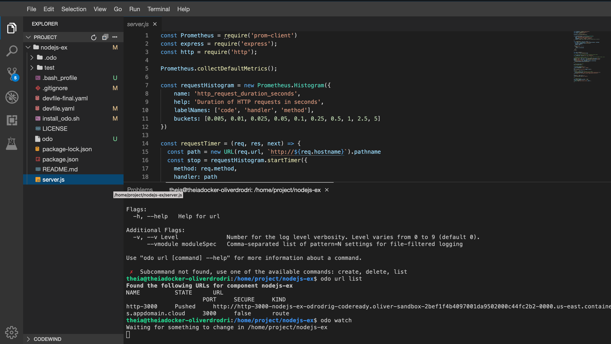

1. Go to line 55 and change the welcome message in `res.send()` to something else like, `Hello this is a test of live updates from odo`.

1. Then save the file by going to `File` -> `Save` or using the save shortcut (cmd + s for Mac, ctrl + s for Windows).

1. Go to your browser tab that had the running application and refresh to see the new message.

    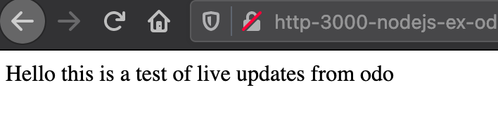

1. Let's end the `odo watch` session by going back to our terminal environment and pressing control + c to end it.

## Conclusion

In this lab we explored the OpenShift developer experience using CodeReady Workspaces which gave us a development environment on OpenShift that we could access through our browser. We then made our own custom workspace using a devfile and made some quick edits to our sample application. Lastly, we explored odo as a cli tool that allows us to build containerized applications without having to write dockerfiles or kubernetes manifests. Using odo we were able to create a development environment that was defined in a devfile and deploy an application to OpenShift.